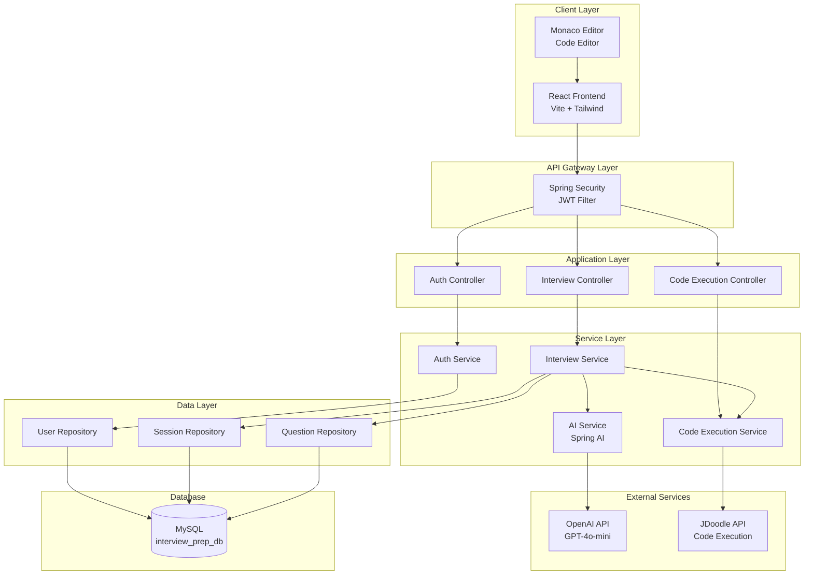

# System Architecture

## High-Level Architecture Diagram



## Component Details

### Frontend Architecture

```
React Application
├── Pages
│   ├── Login/Register (Public)
│   ├── Dashboard (Protected)
│   ├── StartInterview (Protected)
│   ├── InterviewSession (Protected)
│   └── Results (Protected)
├── Components
│   ├── MonacoEditorWrapper (Code Editor)
│   ├── CodeRunner (Code Execution UI)
│   ├── QuestionRenderer (Question Display)
│   ├── FeedbackCard (AI Feedback Display)
│   └── Navbar (Navigation)
├── Context
│   └── AuthContext (JWT Management)
└── Services
    └── api.js (Axios Instance + Interceptors)
```

### Backend Architecture

```
Spring Boot Application
├── Controllers (REST API)
│   ├── AuthController
│   ├── InterviewController
│   └── CodeExecutionController
├── Services (Business Logic)
│   ├── AuthService (Registration, Login)
│   ├── InterviewService (Session Management)
│   ├── AiService (OpenAI Integration)
│   └── CodeExecutionService (JDoodle Integration)
├── Repositories (Data Access)
│   ├── UserRepository
│   ├── InterviewSessionRepository
│   └── SessionQuestionRepository
├── Entities (Domain Models)
│   ├── User
│   ├── InterviewSession
│   └── SessionQuestion
├── Security
│   ├── SecurityConfig (Spring Security)
│   ├── JwtAuthenticationFilter
│   └── UserDetailsServiceImpl
└── Config
    ├── CorsConfig
    ├── WebClientConfig
    └── JwtUtil
```

## Data Flow

### Interview Flow

1. **User starts interview**
   ```
   Frontend → POST /api/interviews/start
   → InterviewController.startInterview()
   → InterviewService.createSession()
   → AI Service generates questions
   → Save to database
   → Return session with questions
   ```

2. **User submits answer**
   ```
   Frontend → POST /api/interviews/{sessionId}/answer
   → InterviewController.submitAnswer()
   → InterviewService.submitAnswer()
   → If coding: CodeExecutionService.executeCode()
   → AI Service evaluates answer
   → Update database
   → Return feedback
   ```

3. **Code execution flow**
   ```
   Frontend → POST /api/code/execute
   → CodeExecutionController.executeCode()
   → CodeExecutionService.executeCode()
   → JDoodle API (external)
   → Return output/error
   ```

## Security Architecture

### Authentication Flow

```
1. User registers/logs in
   → AuthService validates credentials
   → JwtUtil generates JWT token
   → Token returned to frontend
   → Stored in localStorage

2. Subsequent requests
   → Frontend adds "Authorization: Bearer {token}" header
   → JwtAuthenticationFilter intercepts
   → Validates token
   → Sets Authentication in SecurityContext
   → Request proceeds
```

### Security Layers

1. **Frontend**: Protected routes, token storage
2. **API Gateway**: JWT validation filter
3. **Service Layer**: Authorization checks
4. **Database**: Parameterized queries (JPA)

## AI Integration Architecture

### Question Generation

```
InterviewService.createSession()
  → For each question:
    → AiService.generateQuestion(topic, difficulty, type)
    → Spring AI ChatClient
    → OpenAI API (GPT-4o-mini)
    → Returns question text
    → Saved to database
```

### Answer Evaluation

```
InterviewService.submitAnswer()
  → AiService.evaluateAnswer(question, answer, type)
  → Spring AI ChatClient with prompt template
  → OpenAI API
  → Returns JSON: {score, feedback, explanation, suggestions}
  → Parsed and saved
```

## Code Execution Architecture

### JDoodle Integration

```
CodeExecutionService.executeCode()
  → Builds payload: {code, stdin, language, versionIndex}
  → WebClient POST to JDoodle API
  → JDoodle compiles/executes Java code
  → Returns: {output, error, memory, cpuTime}
  → Parsed and returned to frontend
```

**Security Note**: Code is NEVER executed on the server. All execution happens via JDoodle API.

## Database Design

### Entity Relationships

```
User (1) ────< (Many) InterviewSession
                    │
                    └───< (Many) SessionQuestion
```

### Key Design Decisions

1. **Session-based**: Each interview is a session with multiple questions
2. **Question Ordering**: `question_order` field for sequence
3. **Flexible Storage**: TEXT fields for questions/answers/feedback
4. **Score Tracking**: Per-question and session-level scores

## API Design

### RESTful Principles

- **Resources**: `/interviews`, `/sessions`, `/code`
- **HTTP Methods**: GET (read), POST (create), PUT (update)
- **Status Codes**: 200 (OK), 201 (Created), 400 (Bad Request), 401 (Unauthorized), 404 (Not Found)
- **Error Handling**: Consistent error responses with messages

## Scalability Considerations

### Current Architecture
- Monolithic Spring Boot application
- Single MySQL database
- Stateless JWT authentication

### Future Scalability Options

1. **Microservices**: Split into Auth, Interview, AI services
2. **Caching**: Redis for session data, question cache
3. **Load Balancing**: Multiple backend instances
4. **Database**: Read replicas, sharding
5. **Message Queue**: Async AI processing (RabbitMQ/Kafka)
6. **CDN**: Static frontend assets

## Monitoring & Logging

- **Logging**: SLF4J with Spring Boot logging
- **Health Checks**: Spring Actuator `/actuator/health`
- **Error Tracking**: Consider Sentry/Logback
- **Metrics**: Consider Micrometer + Prometheus
